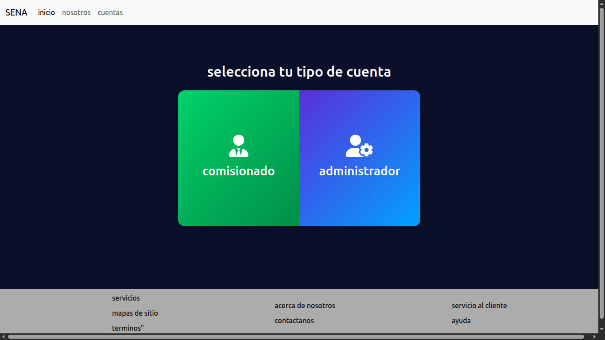
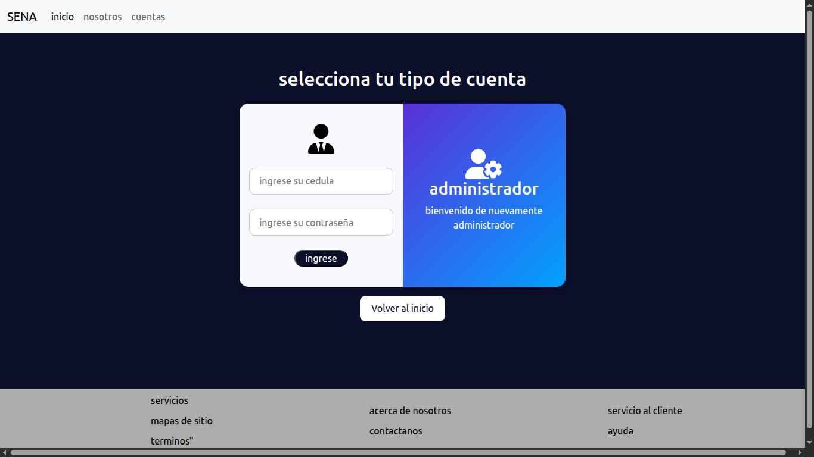
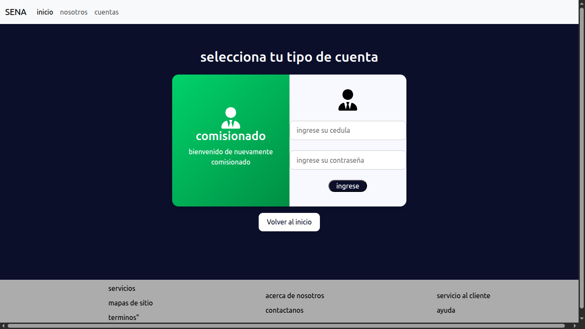
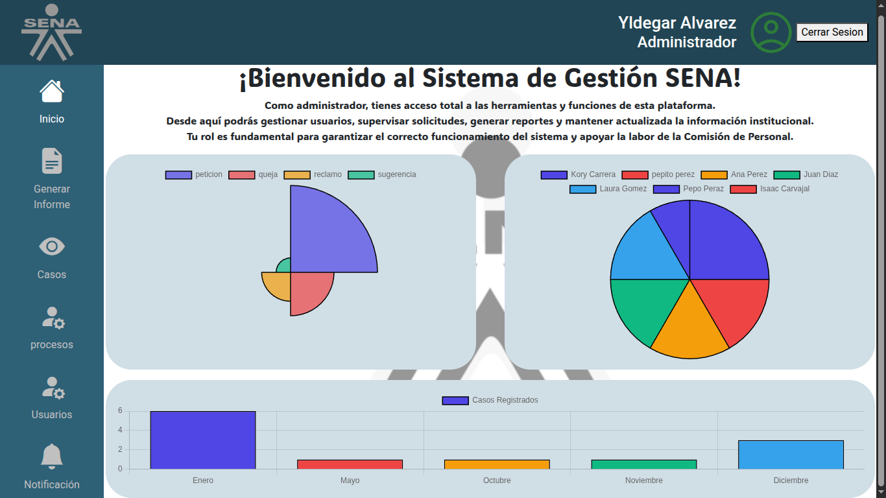
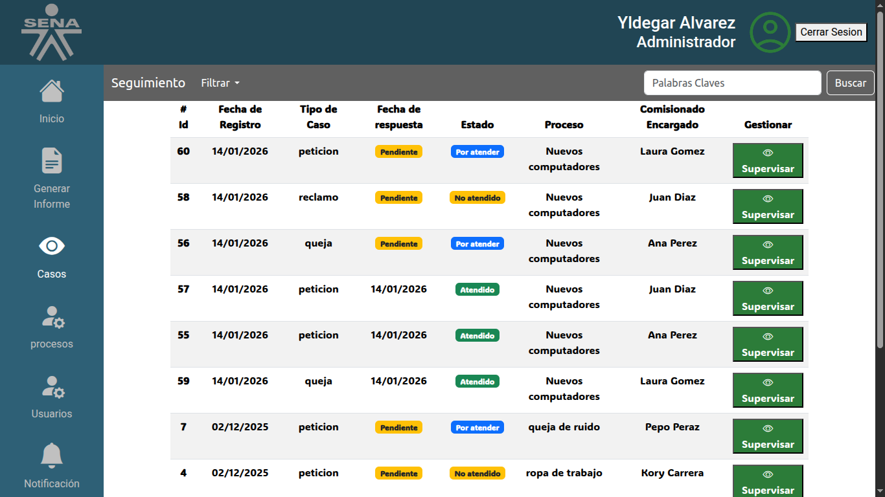

# 📋 Sistema de Gestión PQRSD - SENA

[](https://www.php.net/)
[](https://mariadb.org/)
[](https://www.docker.com/)
[](LICENSE)

Sistema web para la gestión eficiente de Peticiones, Quejas, Reclamos, Sugerencias y Denuncias (PQRSD) del personal interno del SENA.

---

## 📑 Tabla de Contenidos

- [Descripción](#-descripción)
- [Características](#-características)
- [Tecnologías](#-tecnologías)
- [Requisitos Previos](#-requisitos-previos)
- [Instalación](#-instalación)
- [Uso](#-uso)
- [Estructura del Proyecto](#-estructura-del-proyecto)
- [Capturas de Pantalla](#-capturas-de-pantalla)
- [Problemas Conocidos](#-problemas-conocidos)
- [Roadmap](#-roadmap)
- [Contribuidores](#-contribuidores)
- [Licencia](#-licencia)

---

## 📖 Descripción

Este sistema está dirigido a la **Comisión de Personal del SENA**, organismo encargado de atender y responder PQRSD del personal interno.

### Problemática
Actualmente, la comisión maneja un alto flujo de peticiones que hace **insostenible e ineficiente** la correcta resolución de los casos con métodos tradicionales.

### Solución
Sistema web que proporciona:
- **Orden y estructura** para que los comisionados atiendan casos de forma eficiente
- **Herramientas de supervisión** para administradores
- **Generación automática de informes** (PDF/Excel)
- **Visualización de estadísticas** en tiempo real

> 🎓 **Proyecto Académico:** Desarrollado como proyecto final de formación técnica en el SENA, con un cliente real (Comisión de Personal) que valida y aprueba requisitos.

---

## ✨ Características

### 👨‍💼 Rol: Administrador
- ✅ Gestión completa de usuarios (crear, editar, inhabilitar)
- ✅ Gestión de procesos organizacionales (categorías de casos)
- ✅ Supervisión de todos los casos registrados
- ✅ Generación de reportes en **PDF** y **Excel**
- ✅ Dashboard con estadísticas visuales (Chart.js)
- 🔄 Notificaciones (En desarrollo)

### 👨‍💻 Rol: Comisionado
- ✅ Registro de nuevos casos PQRSD
- ✅ Visualización de casos propios y generales
- ✅ Dashboard con estadísticas personalizadas
- 🔄 Adjuntar evidencias (imágenes/videos) - En desarrollo
- 🔄 Acceso restringido solo a casos asignados - En desarrollo

---

## 🛠️ Tecnologías

### Backend
- **PHP 8.2** - Lenguaje principal
- **MariaDB 10.6** - Base de datos relacional
- **Stored Procedures** - Prevención de inyecciones SQL
- **Arquitectura MVC** - Patrón de diseño personalizado

### Frontend
- **Bootstrap 5** - Framework CSS
- **Chart.js** - Gráficos y estadísticas
- **jQuery 3.7** - Manipulación del DOM
- **CSS/JS personalizado** - Estilos únicos del proyecto

### Librerías PHP
- **[AltoRouter](https://altorouter.com/)** - Enrutamiento de URLs
- **[DOMPDF](https://github.com/dompdf/dompdf)** - Generación de reportes PDF
- **[PhpSpreadsheet](https://phpspreadsheet.readthedocs.io/)** - Generación de reportes Excel

### DevOps
- **Docker** - Contenedorización
- **Docker Compose** - Orquestación de servicios
- **Apache 2.4** - Servidor web

### Contenedores
```yaml
├── app_sena (PHP 8.2 + Apache)
├── db_sena (MariaDB 10.6)
└── phpmyadmin (SGBD Web)
```

---

## 📋 Requisitos Previos

- **Docker Desktop** (versión 20.10 o superior)
- **Git** (para clonar el repositorio)
- Navegador web moderno (Chrome, Firefox, Edge)

> ⚠️ **Nota:** No es necesario tener PHP, Composer ni MySQL instalados localmente. Docker maneja todo.

---

## 🚀 Instalación

### 1️⃣ Clonar el repositorio
```bash
git clone https://github.com/KoryCarrera/Proyecto_SENA.git
cd Proyecto_SENA
```

### 2️⃣ Levantar contenedores con Docker
```bash
docker-compose up --build
```

Este comando:
- ✅ Construye las imágenes Docker
- ✅ Levanta los 3 contenedores (app, db, phpmyadmin)
- ✅ Carga automáticamente el esquema y datos de prueba desde `database/db.sql`
- ✅ Instala dependencias con Composer

### 3️⃣ Acceder al sistema

Una vez levantados los contenedores:

| Servicio | URL | Puerto |
|----------|-----|--------|
| **Aplicación** | http://localhost:8000 | 8000 |
| **phpMyAdmin** | http://localhost:8001 | 8001 |

---

## 🔐 Uso

### Credenciales de Prueba

#### Administrador
```
Documento: 1111111111
Contraseña: 123456
```

#### Comisionado
```
Documento: 2222222222
Contraseña: 123456
```

### Flujo de Uso

1. **Acceder** a http://localhost:8000
2. **Seleccionar** tipo de usuario (Administrador/Comisionado)
3. **Iniciar sesión** con credenciales de prueba
4. **Explorar** las funcionalidades según el rol

---

## 📂 Estructura del Proyecto
```
Proyecto_SENA/
├── app/
│   ├── config/
│   │   └── conexion.php          # Configuración de BD
│   ├── controllers/
│   │   ├── loginAdmin.php        # Autenticación admin
│   │   ├── loginComisionado.php  # Autenticación comisionado
│   │   ├── reportePDF.php        # Generador de PDF
│   │   ├── reporteExcel.php      # Generador de Excel
│   │   └── ...
│   ├── models/
│   │   ├── getData.php           # Consultas SELECT
│   │   ├── insertData.php        # Consultas INSERT
│   │   ├── updateData.php        # Consultas UPDATE
│   │   ├── disableData.php       # Consultas DELETE lógico
│   │   └── seguridad.php         # Validaciones
│   ├── views/
│   │   ├── admin/                # Vistas de administrador
│   │   └── comisionado/          # Vistas de comisionado
│   └── router.php                # Definición de rutas
├── Public/
│   ├── assets/
│   │   ├── css/                  # Estilos personalizados
│   │   ├── js/                   # Scripts JavaScript
│   │   └── img/                  # Imágenes y logos
│   ├── index.php                 # Front Controller
│   └── landing.php               # Página de inicio
├── database/
│   └── db.sql                    # Schema + Data inicial
├── docker-compose.yml            # Orquestación Docker
├── Dockerfile                    # Imagen del contenedor
├── composer.json                 # Dependencias PHP
└── README.md                     # Este archivo
```

---

## 📸 Capturas de Pantalla

### 🏠 Página de Inicio


### 🔐 Login Administrador


### 🔐 Login Comisionado


### 📊 Dashboard Administrador


### 📋 Gestión de Casos


---

## ⚠️ Problemas Conocidos

### 🐛 Bugs
- **Validación de sesión incompleta**: Los usuarios pueden acceder a interfaces de ambos roles (admin/comisionado) sin restricción estricta.

### 🚧 Funcionalidades Pendientes
- Sistema de notificaciones en tiempo real
- Adjuntar evidencias fotográficas/videos a casos
- Alertas automáticas por correo electrónico
- Control de acceso basado en casos asignados (comisionados solo ven sus casos)

---

## 🗺️ Roadmap

### Próximas Implementaciones
- [ ] Sistema completo de notificaciones
- [ ] Envío de alertas por email
- [ ] Gestión de evidencias multimedia
- [ ] Aplicación de protocolos OWASP
- [ ] Restricción de acceso por rol refinada
- [ ] Mejoras en interfaz CSS
- [ ] Panel de auditoría de acciones

---

## 👥 Contribuidores

Desarrollado por:

- **[Kory Carrera](https://github.com/KoryCarrera)** - Líder de Proyecto / FullStack
- **[Zack-Xd](https://github.com/Zack-Xd)** - Desarrollador Backend
- **[Juan Correal](https://github.com/juan-correal)** - Desarrollador Frontend
- **[Simón Peláez](https://github.com/pelaezgonzalezsimon919-cyber)** - Analista de BD / Desarrollador Backend

> 🎓 Proyecto académico - Formación Técnica SENA 2025

---

## 📄 Licencia

Este proyecto está bajo la Licencia MIT - ver el archivo [LICENSE](LICENSE) para más detalles.

---

## 🙏 Agradecimientos

- **Comisión de Personal del SENA** - Cliente y validador de requisitos
- **Instructores SENA** - Guía y acompañamiento técnico
- Comunidad Open Source por las librerías utilizadas

---

## 📞 Contacto

¿Dudas o sugerencias? Abre un [issue](https://github.com/KoryCarrera/Proyecto_SENA/issues) en el repositorio.

---

<div align="center">
  <strong>Hecho con ❤️ por el equipo de desarrollo SENA</strong>
  <br>
  <sub>Proyecto Académico 2025</sub>
</div>